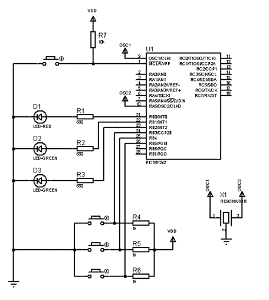
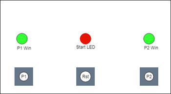
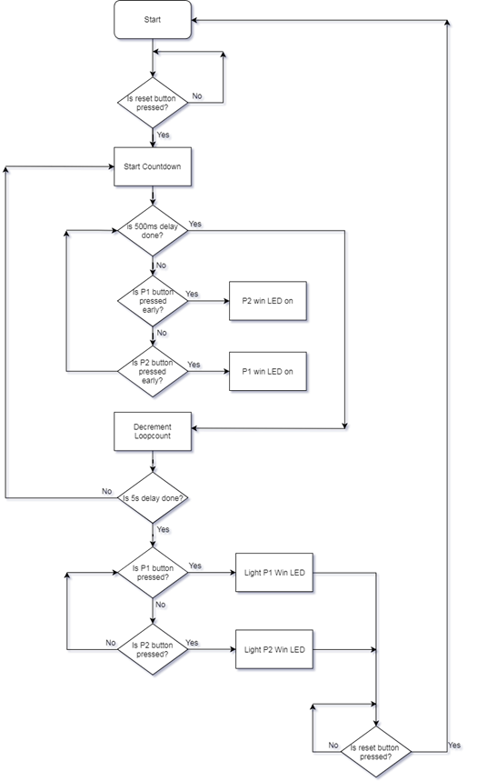
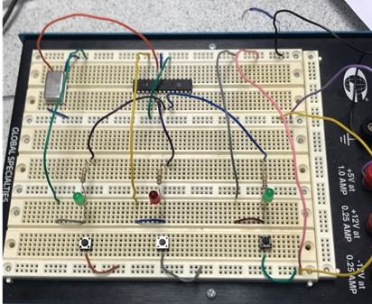

# asm-reaction-game
2-player game. The program counts down from 5 seconds. On reaching zero, an LED is lit. The first player to press their respective button wins. Pressing the button before the start signal results in the other player winning.

The peripheral hardware consists of 3 LEDs and 3 push-button switches as shown in the image below.
Each player has an LED and a switch. The centre LED is lit after the 5-second count-down. The player who reacts fastest will have their LED lit to signify they are the winner. The button in the centre restarts the game.
## Hardware
  

## Software
The countdown timer is implemented using a 500ms delay which is run 10 times. As the countdown takes place, the program continuously checks to see if either player has pressed their button too early, resulting in them losing the game. Afterthe 500ms delay has been run 10 times, the program continues to check both player button inputs until a press is detected and the corresponding LED is lit. The program then loops infinitely until the reset button is pressed.

### Breadboard implementation: 

